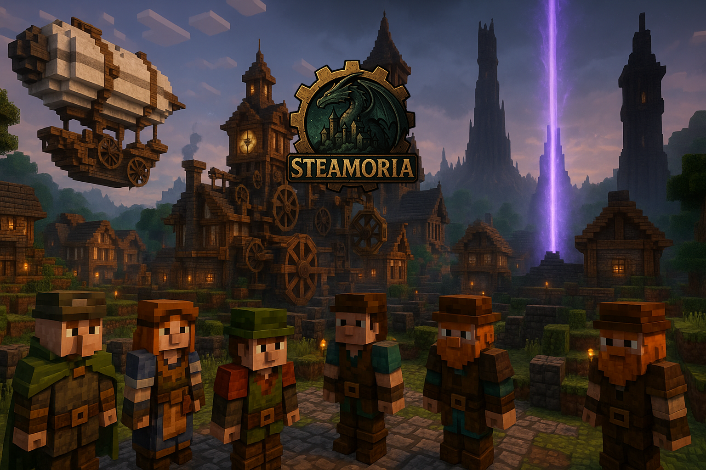

    
    <h1>Steamoria</h1>
    
Invent, Rule and Protect your colony in a magical fantasy setting with Create, MineColonies and several immersion and adventure mods!

    
    
     
     
    <a href="https://marvin.raiser.dev/Steamoria">Website</a>
    &nbsp;&nbsp;•&nbsp;&nbsp;
    <a href="https://www.curseforge.com/minecraft/modpacks/steamoria">CurseForge</a>
     
    

## Setting
Fantasy world generated by Terralith, Tectonic, TerraBlender and Biomes O'Plenty with slightly bigger biome generation.

Primary Mods are MineColonies, Create (with many addons), IronSpells, IceAndFire, Farmers Delight, Botania combined with a lot of other mods.

## Changelog

<h2>📦 1.3.0 - 🗓️ 2025-05-26</h2>

Updated all mods including new Versions and features of MineColonies and adds some compatiblity and quality of life mods.

### 🛠️ Mods

- ❇️ `AE2 Crafting Tree`: 1.0.5
- ❇️ `Better Compatibility Checker`: 4.0.8
- ❇️ `Create: Wizardry`: 0.2.3
- ❇️ `Create Stock Bridges`: 0.1.2
- ❇️ `Lunar`: 0.2.1
- ❇️ `PingHUD`: 3.0
- ❇️ `Polymorhpic Energestics`: 0.1.1
- ❇️ `Screenshot To Clipboard`: 1.0.9
- ❇️ `Simple Discord Rich Presence`: 4.0.3
- ❇️ `Waddles`: 0.9.4
- 🔝 `AmbientSounds`: 6.1.9 -> 6.1.11
- 🔝 `Balm`: 7.3.27 -> 7.3.30
- 🔝 `Byzantine`: 32 -> 32.1
- 🔝 `Create: Central Kitchen`: 1.4.0 -> 1.4.1
- 🔝 `Create: Jetpack`: 4.4.0 -> 4.4.1
- 🔝 `Create: Power Loader`: 2.0.0 -> 2.0.3
- 🔝 `Create: Structures Arise`: 156.29.28 -> 158.31.30
- 🔝 `Create: Framed`: 1.6.3 -> 1.6.5
- 🔝 `Disenchanting Table`: 4.0.2 -> 5.0.0
- 🔝 `Elydratrims`: 3.5.7 -> 3.5.9
- 🔝 `FancyMenu`: 3.5.0 -> 3.5.2
- 🔝 `Framework`: 0.7.12 -> 0.7.15
- 🔝 `Lithostitched`: 1.4.4 -> 1.4.8
- 🔝 `Macows Bridges`: 3.0.0 -> 3.1.0
- 🔝 `MineColonies`: 1.1.876-snapshot -> 1.1.901-snapshot
- 🔝 `ModernFix`: 5.21.0 -> 5.23.0
- 🔝 `MonoLib`: 2.0.0 -> 2.1.0
- 🔝 `SnowRealMagic`: 10.5.2 -> 10.6.2
- 🔝 `SophisticatedBackpacks`: 3.23.14.1233 -> 3.23.18.1247
- 🔝 `SophisticatedCore`: 1.2.52.967 -> 1.2.66.997
- 🔝 `SophisticatedStorage`: 1.3.40.1140 -> 1.3.46.1160
- 🔝 `StorageDrawers`: 12.9.13 -> 12.9.14
- 🔝 `Structurize`: 1.0.771 -> 1.0.772

### 📑 Config
- `SnowRealMagic`: adds new configs for: snowSpawnMaxLightLevel: 9, snowPersistMaxLightLevel: 11

---

<h2>📦 1.2.0 - 🗓️ 2025-05-08</h2>

Updated all MineColonies mods, updated several others and added Create Deco and a Create money trading system.

### 🛠️ Mods

- ❇️ `GuideME`: 20.1.7
- ❇️ `Create: Deco`: 2.0.3
- ❇️ `CorpseCurioCompat`: 2.2.2
- ❇️ `Create: Numismatics`: 1.0.15
- ❇️ `What Are They Up To`: 1.2.3  (+ CoroUtil Lib)
- 🔝 `AppliedEnergetics2`: 15.3.4 -> 15.4.2
- 🔝 `Create: Furnitures`: 1.0.8 -> 1.0.9
- 🔝 `JadeAddons`: 5.3.1 -> 5.5.0
- 🔝 `SophisticatedCore`: 1.2.51.966 -> 1.2.52.967
- 🔝 `Trading Floor`: 2.0.2 -> 2.0.3
- 🔝 `Via Romana`: 1.3.3 -> 1.4.0
- 🔝 `CTOV`: 3.4.13 -> 3.4.14
- 🔝 `Geophilic`: 3.4 -> 3.4.1
- 🔝 `Irons Spellbooks`: 3.4.0.8 -> 3.4.0.9
- 🔝 `Mcw Lights`: 1.1.0 -> 1.1.2
- 🔝 `Mcw Roofs`: 2.3.1 -> 2.3.2
- 🔝 `TwilightDelight`: 2.0.13 -> 2.0.14
- 🔝 `Structurize`: 1.0.742 -> 1.0.771
- 🔝 `SmallColonies`: 1.1.2 -> 1.2
- 🔝 `Moonlight`: 2.13.83 -> 2.14.1
- 🔝 `MineColonies`: 1.1.603-release -> 1.1.876-snapshot
- 🔝 `DomumOrnamentum`: 1.0.186-release -> 1.0.285-snapshot
- 🔝 `Byzantine`: 31.3 -> 32
- 🔝 `BlockUI`: 1.0.156-release -> 1.0.190-snapshot
- ❌ `DynamicFPS`: Due to slower garbage collecting it caused out of RAM errors.

### 📑 Config
- `DefaultConfigs`: Apply new keybinds.
- `MineColonies`: (Client) Double neighbour building range to render other buildings while placing new buildings
- `Forgematica`: Add default forgematica config with keybinds
- `MajruszDifficulty`: Enable per player difficulty
- `PingWheel`: Pings stay 3 sec longer, pings have double the range.
- `WorldEdit`: Add default worldedit config
- `JEI`: List max rows should cover the entire screen now. Enables more tag/fluid features. Updates to match other mods.

### Keybinds
- `Ö`: Open Forgematica GUI
- `Ä`: Execute Forgematica Operation
- `CTRL+M`: Replay Event Marker

---

<h2>📦 1.1.0 - 🗓️ 2025-05-02</h2>

Fixes and adds/removes a few mods.

### 🛠️ Mods

- ❇️ `AlekiNiftyShips`
- ❇️ `NiftyShipsBiomesoplenty`
- ❇️ `Create: Oxidized`
- ❇️ `No Hostiles around Campfire`
- ❇️⚙️ `Forgematica & mafglib`
- ❇️⚙️ `WorldEdit`
- 🔝 `AmbientSounds`: 1.20.1_6.1.8 -> 1.20.1_6.1.9
- 🔝 `BadOptimizations`: 1.20.1_2.2.1 -> 1.20.1_2.2.2
- 🔝 `Better Enchanted Books`: 1.20.1_3.0.0 -> 1.20.1_4.0.0
- 🔝 `Born in Chaos`: 1.20.1_1.6.3 -> 1.20.1_1.7.0
- 🔝 `ChatHeads`: 1.20.1_0.13.17 -> 1.20.1_0.13.18
- 🔝 `Chloride`: 1.20.1_1.5.5 -> 1.20.1_1.6.0
- 🔝 `Collective`: 1.20.1_8.1 -> 1.20.1_8.3
- 🔝 `Create: Better Motors`: 1.20.1_3.0.0 -> 1.20.1_3.0.1
- 🔝 `Create: Enchantment Industry`: 1.20.1_1.3.2_create-6.0.3 -> 1.20.1_1.3.2_create-6.0.4
- 🔝 `Create: Furnitures`: 1.20.1_1.0.6 -> 1.20.1_1.0.8
- 🔝 `Create: Stuff & Additions`: 1.20.1_2.0.9 -> 1.20.1_2.1.0
- 🔝 `Create: Structures Arise`: 151.24.23 -> 156.29.28
- 🔝 `Create: New Age Forge`: 1.1.3 -> 1.1.4
- 🔝 `Create: Ore Excavation`: 1.6.2 -> 1.6.3
- 🔝 `DoubleDoors`: 6.2 -> 7.0
- 🔝 `Fusion`: 1.2.7 -> 1.2.7b
- 🔝 `GrooveModLoader`: 4.0.9 -> 4.0.11
- 🔝 `Kiwi`: 11.8.29 -> 11.8.31
- 🔝 `Moonlight`: 2.13.81 -> 2.13.83
- 🔝 `Mowziesmobs`: 1.7.1 -> 1.7.2
- 🔝 `Polymorph`: 0.49.9 -> 0.49.10
- 🔝 `Sophisticatedbackpacks`: 3.23.11.1222 -> 3.23.14.1233
- 🔝 `Sophisticatedcore`: 1.2.43.949 -> 1.2.51.966
- 🔝 `Sophisticatedstorage`: 1.3.29.1117 -> 1.3.40.1140
- 🔝 `Supplementaries`: 3.1.26 -> 3.1.30
- ❌ `Realm RPG: Imps & Demons`
- ❌ `FTB Teams`
- ❌ `FTB Library`
- ❌ `Neruina`
- ❌ `Born in Configuration`

### 📑 Config
- `DefaultConfigs`: Fix keybindings.
- `FancyMenu`: Disables Music in options
- `FancyMenu`: Lower volume of music
- `FancyMenu`: Main Menu music is now controlled with the music volume bar

---

<h2>📦 1.0.0 - 🗓️ 2025-04-30</h2>

First Release on CurseForge! Changelog relative to previous modpack.

### 🛠️ Mods

- ❇️ `BetterDays`
- ❇️ `Born in Configuration`
- ❇️ `Realm RPG: Dragon Wyrms`
- ❇️ `Realm RPG: Imps & Demons`
- ❇️ `Small Ships`
- ❇️ `FancyMenu`
- ❇️ `Light Overlay`
- ❇️ `Freecam`
- ❇️ `JadeColonies`
- ❇️⚙️ `ReForgedPlay`
- ❌ `FTB Teams`
- ❌ `FTB Library`

### 📑 Config
- `BetterDays`:
  - Doubled Day, Night duration.
  - Enabled sleep at day.
  - Sleeping continues regeneration/starvation effect depending on the hunger level.
  - Sleep takes 2.5 times longer than usual. 
  - Sleep speeds up night time, the more players, the faster.
- `DefaultConfig`: New Keybindings
- `TerraBlender`: Make Nether bioms twice as big.
- `Immersive Aircraft`: Aircraft drops upgrades on destruction, Takes 2.5 times to repair, First-Person by default.
- `Comforts`: Let sleeping bags break with 5% chance.
- `LootBeams`: Incresed range to 3 blocks.
- `IceAndFire`: Set min distance between Dragons to 1000. Cave generation is default.

### ⌨️ Keybinds
- `Y`: Zoom
- `LALT+Y`: Undo Armours Workshop, Undo last Chisel
- `X`: Open Backpack
- `C`: Leave Immersive Aircraft & Raise Sail for Small Ships, Dragon Down´. When in JourneyMap Fullscreen mode pressing C sends the cursors position on the map in the chat.
- `V`: Cast IronSpells
- `B`: New Waypoint
- `N`: Waypoint List
- `M`: JourneyMap Fullscreen
- `,`: Zoom in MiniMap
- `.`: Zoom out MiniMap
- `-`: Toggle all Waypoints
- `F`: Offhand, Pickup Easy Villagers
- `G`: Boost Aircraft, Elydras and Wings. Toggle Jetpack, Dragon Strike, Alex Cave Ability, Toggle Invisibility, Use AstikorCart
- `CTRL + G`: Open Supplementaries Quiver
- `H`: Hover Mode Jetpack, Create Kart Overlay, Dragon Breath
- `J`: RPG Quest Book
- `K`: Toggle Shaders
- `CTRL+K`: Reload Shaders
- `L`: Advancements
- `Ö`: Free
- `Ä`: Free
- `#`: Free
- `Q`: Drop Item
- `E`: Open Inventory, Open Aircraft Inventory
- `R`: Select IronSpell with Wheel. In Inventory get Recipe
- `T`: Chat. In Inventory toggle TrashSlot
- `Z`: Tinkers Helm Interaction
- `LALT+Z`: Redo undone chisel action
- `U`: Show player death history. In Inventory show usage.
- `I`: Tinkers Leggings Interaction
- `O`: Free
- `P`: Social Interaction Menu
- `Ü`: Switch MiniMap Type
- `+`: View Chunk Loaders

